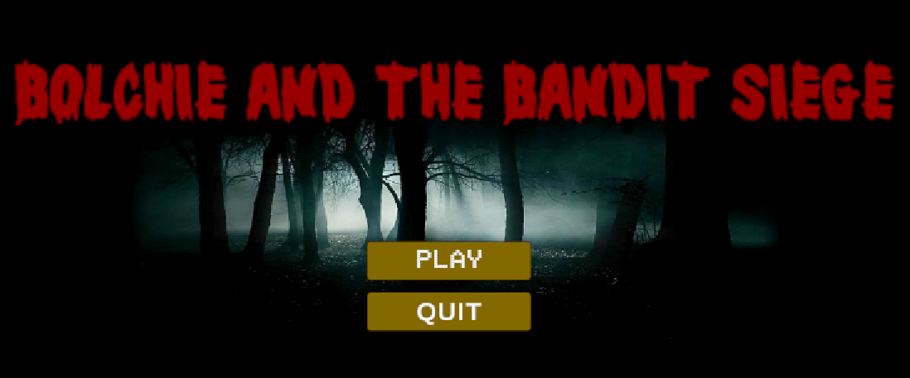
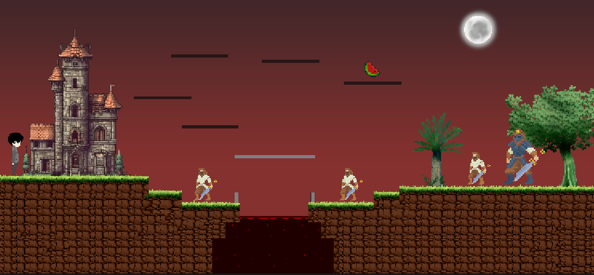
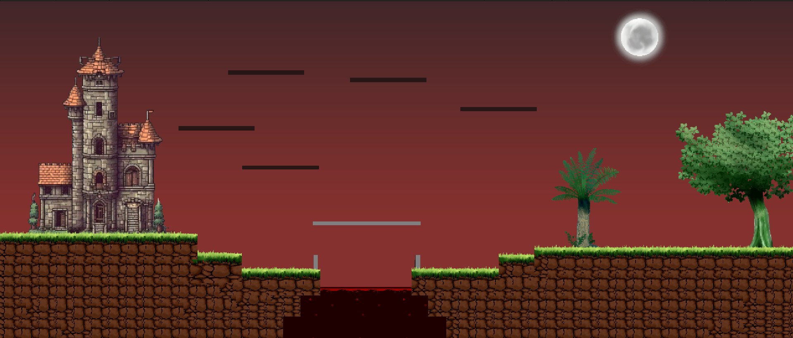
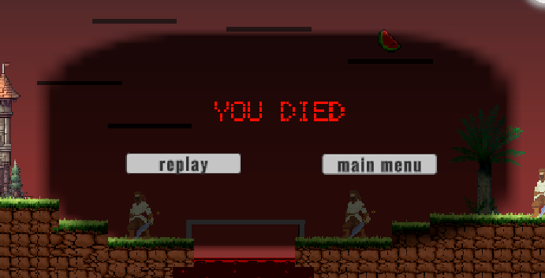

# 🎮 Bolchie and the Bandit Siege

A 2D action platformer built with Unity where Bolchie defends his peaceful village, Dawnwood, from invading bandits. Featuring animated combat, enemy AI, and interactive environments.

## 🕹️ Gameplay Features

- 🎯 Main character: Bolchie with movement, jump, and attack mechanics
- 🧟 Enemies: Small Bandits (1-hit KO), Boss Bandit (multi-hit combat)
- 💥 Health and damage system using Unity Animators and C#
- 🏞️ Tilemap-based terrain with climbable planks, moving bridges, red-water hazards
- 🌙 Night-themed visuals with castles, trees, and glowing moon

## 🧱 Game Structure

- 🎮 Unity 2D Physics + Rigidbody
- 🧠 State Machine & Animation Controllers
- 🎨 Tilemaps + Sprites for level design
- 🔊 Audio feedback for death/win conditions
- 📜 UI menus: Main Menu, Replay, Game Over Screens

## 🔧 Technologies Used

- **Engine:** Unity 2D (C#)
- **Tools:** Tilemap, Animator, Rigidbody2D, Sprite Renderer

## 📸 Screenshots

## 💡 Controls

- ➡️/⬅️: Move  
- Space: Jump  
- Left Alt: Attack  
- 🍉 Collect watermelon to heal  
- 🔴 Touch red water = instant death  

## 👥 Contributors

- Malik Hamza Nawaz  
- Javeria Khalid
